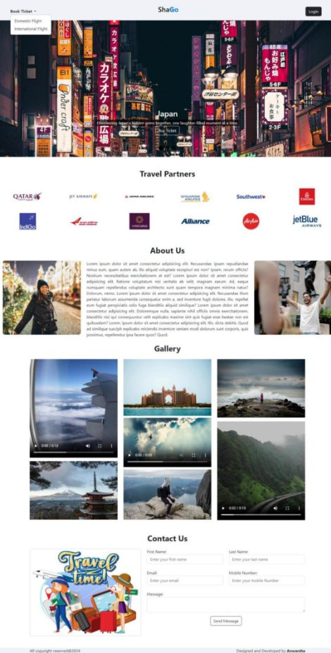

**Project Overview:** Airline Reservation System 

**Project Title:** Airline Reservation System

**Objective:**

The Airline Reservation System is designed to automate the process of booking, managing, and tracking flights for users, making air travel arrangements more efficient and user-friendly. The system allows passengers to search for available flights, book tickets, and receive confirmation emails upon successful reservations.

**Scope:** This project provides an online platform for passengers to book both domestic and international flights. The system also enables airlines to manage their flight schedules, track passenger details, and optimize flight bookings. Additionally, it supports user load scalability and performance optimization for seamless booking operations.

**Key Features:**

1. **Flight Search and Booking**: Users can search for flights based on origin, destination, and dates, and easily book tickets online.
1. **Passenger Management**: Personal details of passengers, including name, email, gender, age, and identification proof, are securely stored for booking purposes.
1. **Email Confirmation**: After successful booking, users receive an automated email confirmation with all flight details.
1. **Scalable Backend**: The system efficiently manages increasing user load by optimizing backend performance for smooth booking and retrieval of flight information.
1. **Admin Module:** Airline administrators can manage flight details, schedules, and view bookings

**Technologies Used:**

- **Backend**: Spring Boot, Java
- **Frontend**: Thymeleaf, Bootstrap, HTML, CSS
- **Database**: MySQL, JPA, Hibernate
- **Mail Service**: JavaMailSender (for sending booking confirmation emails)
- **Tools**: Maven, Git

**Project Images:**

**index page![ref1]** 

**Sign up page![ref1]**

**Login page![ref2]**

**Domestic flight booking page![ref3]**

**Domestic flight available page![ref1]**

**International flight booking![ref2]**

**International flight available page![ref3]**

**Passenger information page**

**Confirmation message**

**Email confirmation**

**Conclusion:**

The Airline Reservation System simplifies the process of booking airline tickets while maintaining efficient backend operations and enhancing user engagement through automated email notifications and a user-friendly interface.

\*\*\*\*\*\*\*\*\*\*\*\*\*\*\*\*\*\*\*\*\*\*\*\*\*\*\*\*\*\*\*\*\*\*\*\*\*\*\*\*\*\*\*\*\*\*\*\*\*\*\*\*\*\*\*\*\*\*\*

[ref1]: ./readMe_images/Aspose.Words.2daa9335-104d-4cb5-b4cf-4fce91bb804d.003.png
[ref2]: ./readMe_images/Aspose.Words.2daa9335-104d-4cb5-b4cf-4fce91bb804d.005.png
[ref3]: ./readMe_images/Aspose.Words.2daa9335-104d-4cb5-b4cf-4fce91bb804d.007.png
